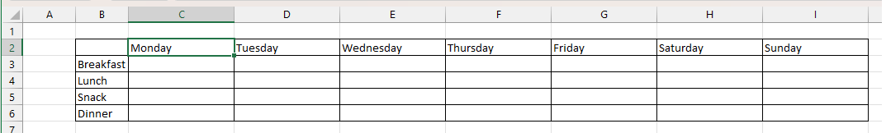
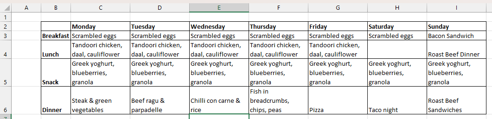

Introduction
============

Based on some old hard-drives, some online repos and some files I had lying around, it looks like some time around 2012 I had an idea for an app. Now, I'm realistic enough to acknowledge that this far on, it's probably not going to be an idea that's ever going to make me rich, or even gain a user base greater than one, but it's been enough of a scratch I want to itch that it's time I addressed it. If nothing else, as is the case for most developers, I don't do a load of greenfield development and the process of going through and setting up an application from scratch isn't one I've done for a while. Added to that, I get to try and out a few new things, make some of my existing skills a bit less rusty, practice and bit of writing and even have something that's useful for me at the end of it.

The Idea
--------

As most of my friends and family will tell you, I am really into eating well.my mother-in-iaw swears that I do some sort of little shuffle/dance at the dinner table when my food arrives. Because I enjoy food so much over the years I've taken the time and effort to try and become a decent home-cook and now most of the food I eat is made from scratch. There is an admin-overhead to doing that, which is not only deciding what to eat each week, but figuring out what ingredients we have on hand, and what we need to buy so The Idea is a tool (or set of tools) to support that. That might include:

* Planning out meals for the week
* Generating a shopping list
* Keeping a record of recipes
* Suggesting meals (could be from leftovers, similar ingredients or "you've not had this for a while")
* Tracking macro-nutrient intake

Current process
---------------

The existing process is fairly manual. My default tool for something like this is Microsoft Excel, although I've not gone to the length of writing any code to automate the process so there's a lot of typing, followed by copy/paste. The first thing is to create an empty grid, something like:

